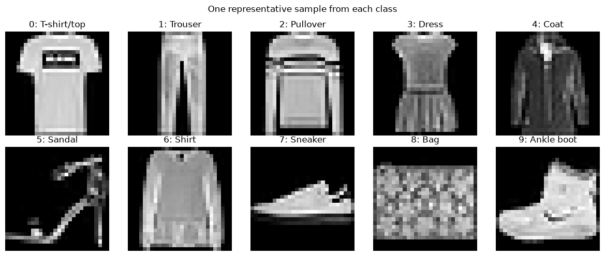
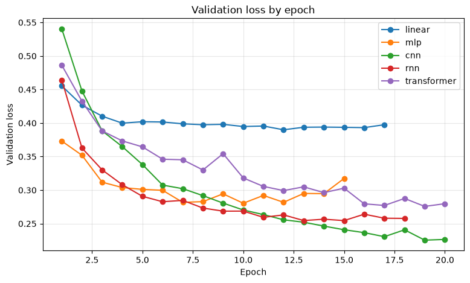
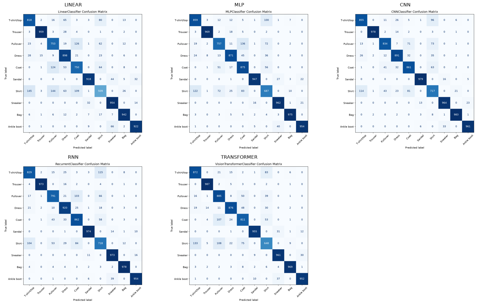

# Assignment 1: Fashion-MNIST Classification

## 1. Problem statement

Fashion-MNIST classifies 28 × 28 grayscale images into ten clothing categories. Some categories, such as shirt, coat, and pullover, have similar appearances, making classification more difficult than simply identifying distinct shapes.

This project compares five model families—Linear, MLP, CNN, recurrent, and Transformer—on the same dataset split and evaluation protocol. The central question is how their different ways of representing an image affect classification performance and computational cost. We compare test accuracy and macro-F1 alongside model size, training and inference time, and patterns of classification errors.

## 2. Dataset and EDA

Fashion-MNIST contains 70,000 labelled grayscale images across ten clothing classes (Xiao et al., 2017). Each image is 28 × 28 pixels. The official dataset provides 60,000 training images and 10,000 test images. We split the official training set into 54,000 training and 6,000 validation images using a stratified split with seed 42, preserving the class proportions. The official test set was kept separate for final evaluation.

The official training set is balanced, with 6,000 images in each class, so class imbalance does not require weighting or resampling. Representative samples show that trousers and bags have distinctive outlines, while shirt, T-shirt/top, pullover, and coat look more similar at this resolution. This suggests that distinguishing those upper-body clothing classes may be challenging; the evaluation results will test whether that expectation appears in the models' errors.



*Representative images from the ten Fashion-MNIST classes.*

## 3. Methodology

The five models receive the same normalized images but represent them differently. Linear and MLP flatten each 28 × 28 image into 784 pixel values. CNN keeps the two-dimensional image structure and learns spatial features through convolutions. The recurrent model uses a GRU to read the image as a sequence of 28 rows, while the Transformer divides it into 49 non-overlapping 4 × 4 patches and adds positional information.

All models use the same data split and training procedure. Pixel normalization uses the mean and standard deviation calculated from the training subset only, then applies those values to validation and test images. Models are trained with cross-entropy loss and AdamW. After each epoch, validation loss determines whether to save a new best checkpoint; early stopping ends training when improvement stalls. The held-out test set is used only to evaluate the selected checkpoint.

## 4. Experimental setup

All five baseline runs used seed 42 and a batch size of 128. Training was configured for a maximum of 20 epochs with AdamW, a learning rate of 0.001, and weight decay of 0.0001. Early stopping used a patience of five epochs and a minimum meaningful improvement in validation loss of 0.0001.

The analysis notebook recorded the environment after the runs: Python 3.12.10, PyTorch 2.14.0+cu130, Torchvision 0.29.0+cu130, and scikit-learn 1.9.0, with an NVIDIA GeForce RTX 5070 Ti available. These versions were recorded after training rather than stored separately with each run.

## 5. Results

The following test results use each model's best-validation-loss checkpoint.

| Model | Test loss | Test accuracy | Macro-F1 |
| --- | ---: | ---: | ---: |
| Linear | 0.4455 | 84.23% | 0.8395 |
| MLP | 0.3318 | 88.56% | 0.8855 |
| CNN | 0.2691 | 90.23% | 0.9023 |
| GRU | 0.2926 | 89.72% | 0.8970 |
| Transformer | 0.3015 | 89.16% | 0.8908 |

| Model | Trainable parameters | Training time (s) | Inference per image (ms) |
| --- | ---: | ---: | ---: |
| Linear | 7,850 | 290.77 | 0.0013 |
| MLP | 235,146 | 257.38 | 0.0022 |
| CNN | 53,098 | 343.46 | 0.0070 |
| GRU | 61,962 | 305.00 | 0.0033 |
| Transformer | 803,338 | 362.18 | 0.0232 |



*Validation loss by epoch for the five baselines. The “rnn” line represents the GRU model.*

CNN reached the lowest recorded validation loss (0.2254, at epoch 19). The curves have different lengths because early stopping ended Linear, MLP, and GRU training before the 20-epoch maximum. This plot shows validation behavior; the test results in the table above come from each model’s selected best checkpoint.

## 6. Comparison and error analysis

CNN achieved the highest test accuracy (90.23%) and macro-F1 (0.9023) in these baseline runs, despite having far fewer parameters than the Transformer (53,098 versus 803,338). The Transformer reached 89.16% accuracy, so a larger model did not produce a better result under this experimental setup. Linear was the smallest model and had the fastest measured inference per image, but also the lowest test accuracy. These results compare the particular configurations and runs tested; they do not establish that one architecture is always superior.

The following table compares test recall by class. Recall is the percentage of actual examples of a class that the model classified correctly.

| Class | Linear | MLP | CNN | GRU | Transformer |
| --- | ---: | ---: | ---: | ---: | ---: |
| T-shirt/top | 81.8% | 85.9% | 85.5% | 82.9% | 87.2% |
| Trouser | 95.9% | 96.9% | 97.8% | 97.3% | 98.7% |
| Pullover | 75.3% | 75.7% | 83.4% | 79.1% | 88.5% |
| Dress | 89.8% | 87.1% | 89.1% | 92.0% | 87.6% |
| Coat | 75.0% | 87.5% | 86.1% | 86.2% | 81.1% |
| Sandal | 91.8% | 94.7% | 97.9% | 97.4% | 95.5% |
| Shirt | 50.9% | 68.7% | 71.7% | 71.8% | 64.8% |
| Sneaker | 95.4% | 96.2% | 96.4% | 97.3% | 96.1% |
| Bag | 94.2% | 97.5% | 98.3% | 97.8% | 96.9% |
| Ankle boot | 92.2% | 95.4% | 96.1% | 95.4% | 95.2% |

Shirt was the lowest-recall class for every model, supporting the difficulty anticipated from the EDA images. Shirt recall ranged from 50.9% for Linear to 71.8% for GRU; CNN correctly identified 717 of the 1,000 test shirts (71.7%). Of the shirts CNN missed, 114 were predicted as T-shirt/top and 81 as coat. These errors show that visually similar upper-body garments remain difficult even for the best overall model.



*Confusion matrices for all five models. Rows show actual classes; columns show predictions. The RNN panel is the GRU model. [Open the full-size image](figures/all_model_confusion_matrices.png) to read individual counts.*

## 7. Limitations and conclusion

This comparison uses one baseline run per model with seed 42, so it does not measure variation across random seeds or establish that small performance differences are statistically reliable. It compares the selected configurations rather than the best configuration obtainable through extensive tuning. The findings are limited to Fashion-MNIST, and the timing measurements depend on the hardware and conditions under which they were recorded.

Under this shared Fashion-MNIST protocol, CNN achieved the strongest test accuracy and macro-F1 while using substantially fewer parameters than the Transformer. Linear remained a useful small, fast baseline, and the GRU and Transformer were competitive but did not surpass CNN in these runs. Confusion among similar upper-body garments, especially shirts, remains the clearest classification challenge. Repeating runs with additional seeds and tuning each model would help test how stable these findings are.

## 8. Reproducibility

To recreate a baseline, set up Python 3.12 and the dependencies as described in the README, then run the experiment from the `assignment1` directory. For example:

```powershell
python -m experiments.run --model linear --epochs 20 --run-name m2-reproduction --evaluate-test
python -m experiments.run --model mlp --epochs 20 --run-name m2-reproduction --evaluate-test
python -m experiments.run --model cnn --epochs 20 --run-name m2-reproduction --evaluate-test
python -m experiments.run --model rnn --epochs 20 --run-name m2-reproduction --evaluate-test
python -m experiments.run --model transformer --epochs 20 --run-name m2-reproduction --evaluate-test
```

Each command creates a new `results/runs/<model>/<run-id>/` directory containing `best_model.pt`, `training.json`, `evaluation.json`, and generated figures. These run directories are Git-ignored, so the original checkpoints are not included in a fresh clone. Recreating the same protocol requires the corresponding code, configuration, and dependencies; results and timings may vary slightly between environments.

The saved M2 baseline checkpoints are available in the
[M2 baseline release](https://github.com/Winuim12/CO3133-261-Group9-Ryzen9/releases/tag/a1-m2-baselines-2026-09-25).
Download `a1-m2-baseline-runs-20260925-122457.zip`. Each folder in the ZIP
is named by run ID; the table below maps each run ID to its model. To evaluate
a checkpoint, place its run folder under `results/runs/<model>/` and use the
code and configuration from the release tag.

For example, after extracting the Linear run folder to
`results/runs/linear/20260924-124837-513213-m2-baseline/`, run:

```powershell
python -m experiments.run --model linear --evaluate-only --run-id 20260924-124837-513213-m2-baseline
```

The results in this report came from these baseline runs:

| Model | Run ID |
| --- | --- |
| Linear | `20260924-124837-513213-m2-baseline` |
| MLP | `20260924-125349-995443-m2-baseline` |
| CNN | `20260924-125826-798568-m2-baseline` |
| GRU (`rnn`) | `20260924-130429-733285-m2-baseline` |
| Transformer | `20260924-130954-040349-m2-baseline` |

## References

- Xiao, H., Rasul, K., & Vollgraf, R. (2017). *Fashion-MNIST: a Novel Image Dataset for Benchmarking Machine Learning Algorithms*. [arXiv:1708.07747](https://arxiv.org/abs/1708.07747).